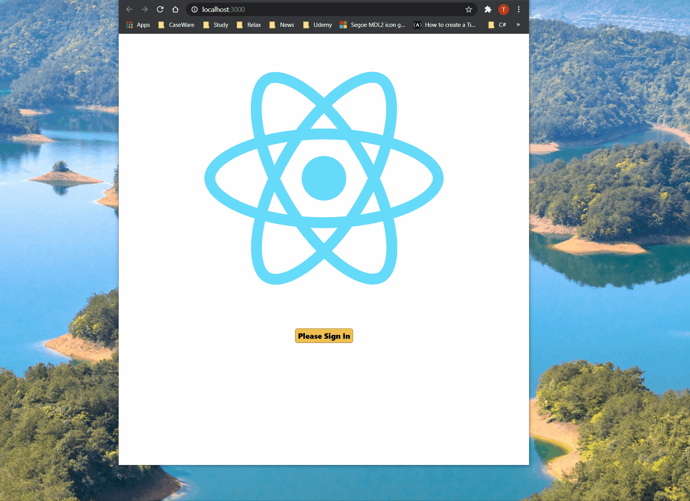

# Demo

## Live demo at
https://fancy-todo-app-demo.web.app/

# Fancy Todo Application
The todo application is powered by 
- React 
- Redux data management
- React Router Dom for routing
- Fireabse google authentication
- Firestore cloud database

# Functionalities
- The todo task is saved into the firestore database, and it is stored by the user loggin into the application
- The user can filter the tasks by compleness and active status

# Test at your local by running
- npm install after clonign (or downloading the git source)
- npm start will power application up

